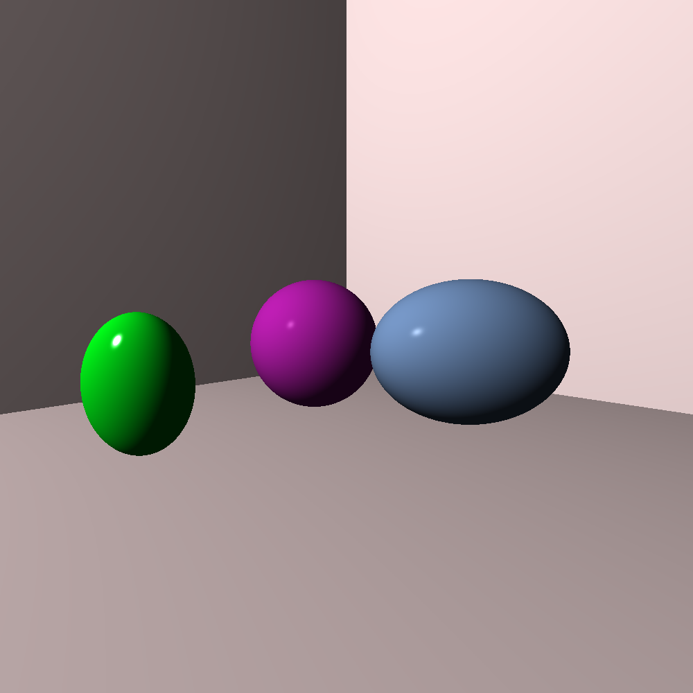
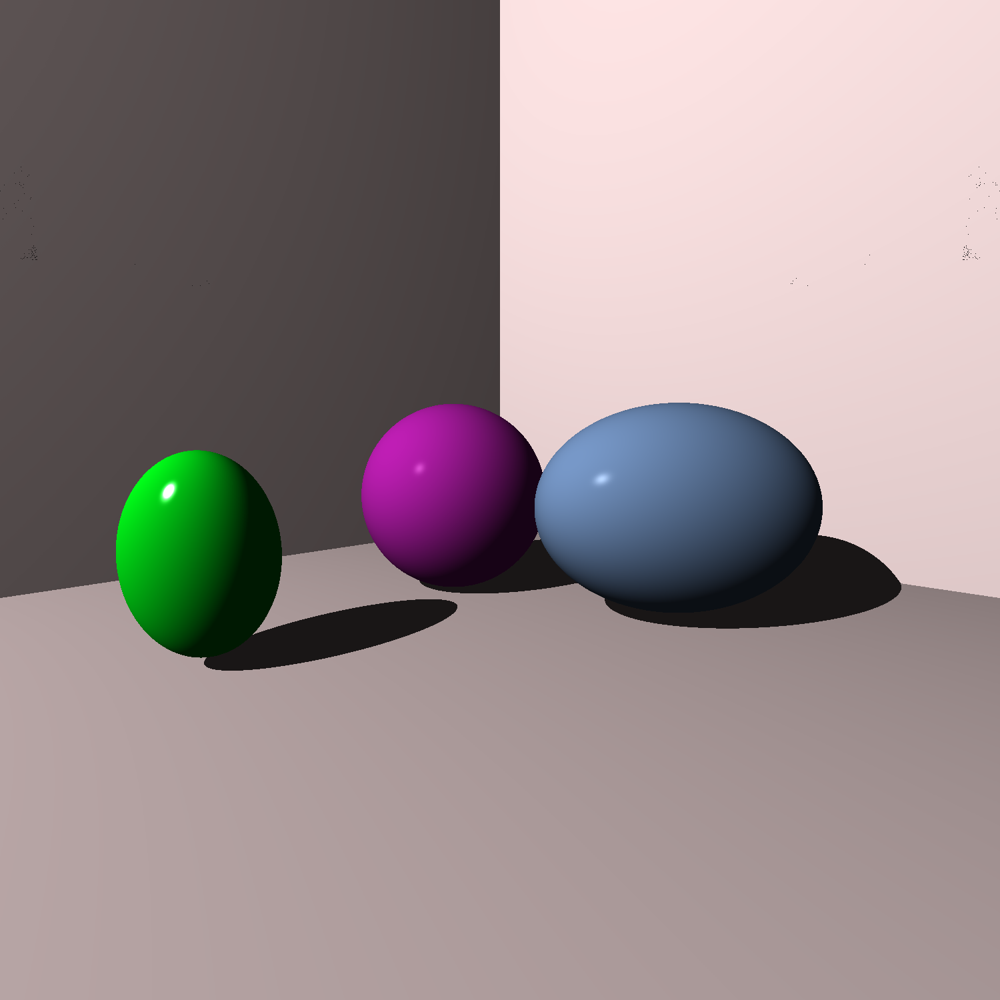
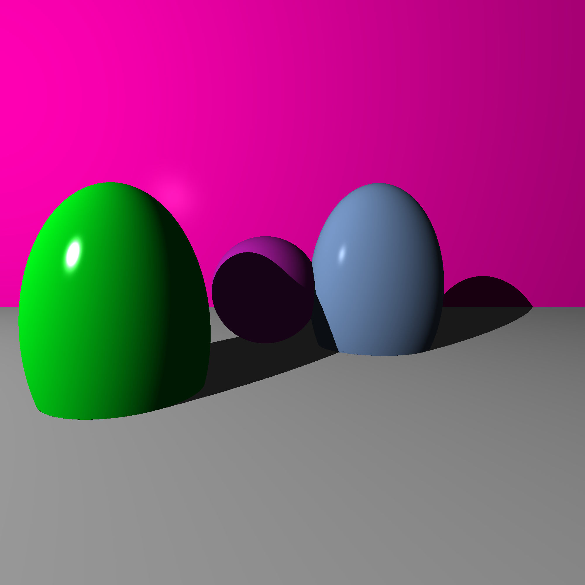

#  Ray Tracer

A small ray tracer that i wrote while reading the ray tracer challenge.

## Building
run `cmake CMakeLists.txt` to generate the makefile
then `make`

## TODO
- clean the project file structure
- optimizations
- clean API

## progress timeline 

### end of chapter 6 
basic raytracing done,sphere shades correctly

### end of chapter 7
added scenes,the possibility of having several objects

### end of chapter 8
added shadows

### end of chapter 9
added planes

### end of chapter 10
added patterns and the option to nest them

