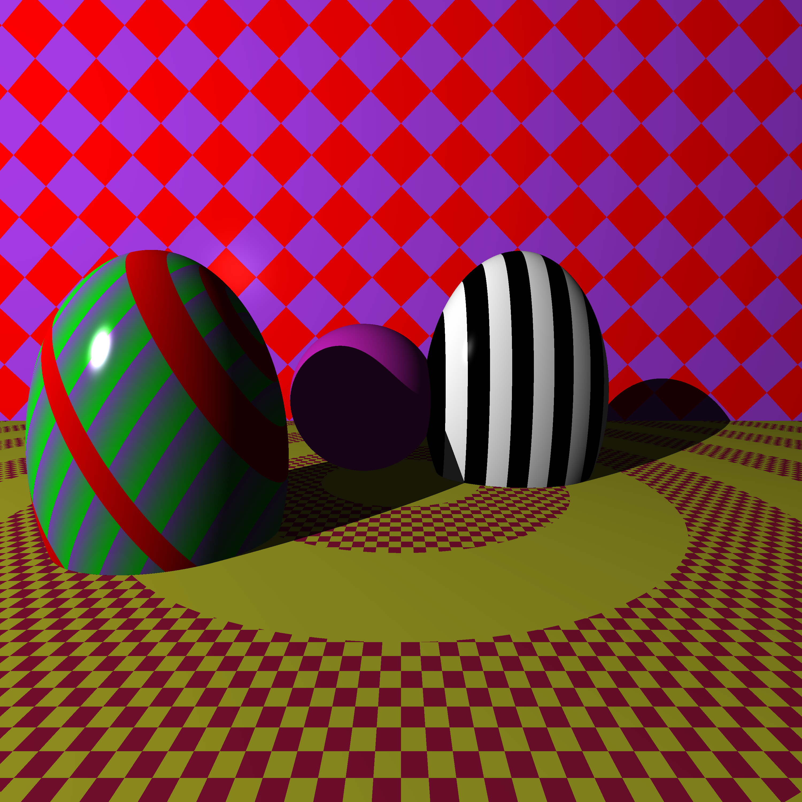

#  Ray Tracer

A small ray tracer that i wrote while reading the ray tracer challenge.

## Building
run `cmake CMakeLists.txt` to generate the makefile
then `make`

## TODO
- clean the project file structure
- add support for building scenes from XML
- clean API
- optimizations:
    - cube-ray intersection
    - children are copied around too much
    
- shapes to add
    - cones

## Progress timeline 

### end of chapter 6 
basic raytracing done,sphere shades correctly

### end of chapter 7
added scenes,the possibility of having several children

### end of chapter 8
added shadows

### end of chapter 9
added planes

### end of chapter 10
added patterns and the option to nest them

### reflections
added reflections 

 

### end of chapter 11
added reflections and refractions

### end of chapter 12
added support for cubes

### end of chapter 13

